# 智能财富管家系统 · 架构说明

> 本文档由代码阅读归纳而成，描述三件事：有哪些 Agent 与功能、它们之间怎么联系、六个 Docker 容器在哪里被使用。
> 术语以根目录 `CONTEXT.md` 为准，架构决定以 `docs/adr/` 为准。

---

## 0. 系统全景

- **形态**：pnpm workspace。两个前端应用 `apps/customer`（客户，5173）、`apps/internal`（内部员工，5174），共享 `packages/shared`；后端 FastAPI 在 `backend/`，不进 workspace。
- **身份域**（ADR-0004）：客户域与内部域彼此隔离 —— 不同的表、不同的 token audience（`customer-app` / `internal-app`）、不同的前端应用。
- **Agent 运行时**（ADR-0007）：五个 Agent 是**同一套 LangGraph 运行时上的五份配置**，不是五套独立实现。配置见 `backend/app/agent/config.py`，注册表见 `backend/app/agent/registry.py`。
- **统一响应信封**：`{code, message, data, trace_id}`（`backend/app/http.py`），由 `TraceIdMiddleware` 生成并回写 `x-trace-id`（`backend/app/main.py:51-72`）。
- **核心约束**：投顾内容必须经理财顾问审核后才能送达客户；确定性判断（适当性过滤、风控阈值、投顾排序）不经过模型。

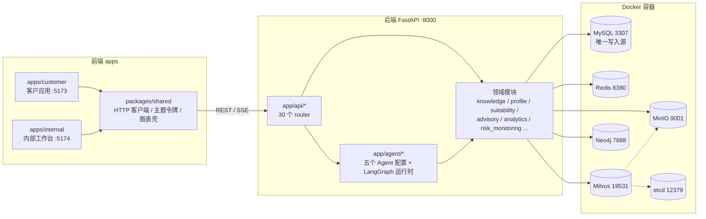

---

## 1. 五个 Agent 与功能

五个 Agent 的定义（名称、工具集、内容分类默认值、身份域、入口路由）集中在 `backend/app/agent/registry.py:37-74`，由 `GET /api/agents` 只读输出（无鉴权，因为它只是静态路由事实，不含客户数据）。

| Agent | 中文名 | 身份域 | 入口路由 | 工具集 | 内容分类默认值 |
|---|---|---|---|---|---|
| `customer_service` | 智能客服 Agent | customer | `POST /api/customer/chat/messages`、`/stream` | `knowledge_search` | 事实性内容 |
| `data_analysis` | 数据分析 Agent | internal | `POST /api/internal/analytics/query` | `analytics_query_generation`、`analytics_query_execution` | 事实性内容 |
| `advisory` | 投顾助手 Agent | internal | `POST /api/internal/advisory/customers/{id}/plan` | `candidate_pool_ranking`、`allocation_suggestion` | **投顾内容**（必须审核） |
| `operation_advice` | 业务操作 Agent | internal | `POST /api/internal/customers/{id}/operation-advice` | `candidate_pool_query`、`customer_holdings_and_balance_query`、`operation_advice_generation` | **投顾内容**（必须审核） |
| `risk_monitoring` | 风控监测 Agent | internal | `POST /api/internal/risk-monitoring/query` | `risk_alert_query`、`work_order_operation`、`risk_rule_query` | 事实性内容 |

### 1.1 智能客服 Agent（`customer_service`）

**面向对象**：客户。**能力边界**：工具集内只有 `knowledge_search`，不存在推荐类能力，因此只能产出事实性内容。

**运行时图**（`backend/app/agent/graph.py:118-262`）：

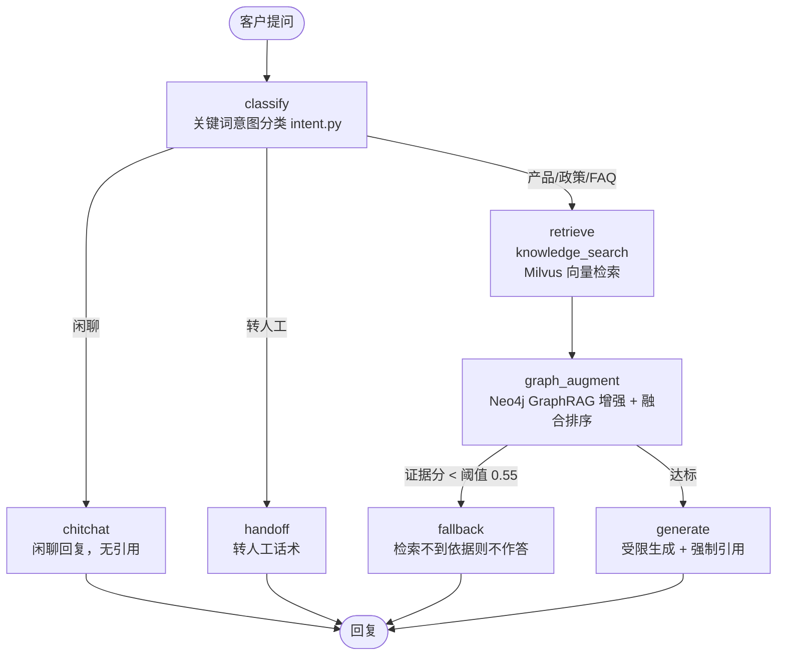

要点：
- 意图分类是**关键词确定性判断**（`agent/intent.py:36-47`），金融关键词优先于闲聊词，避免「你好，请问费率…」被误判。
- 混合召回 → RRF → 融合排序：向量臂（Milvus）与关键词臂（分块镜像上的 BM25，`knowledge/service.py`）各出 `HYBRID_RECALL_TOP_K` 条，先按位次做 RRF（`knowledge/hybrid.py`），候选再与图谱段落做加权和：`score = 0.6 × 相似度分 + 0.4 × 图谱分`（`settings.py`，`agent/fusion.py`）。
- 兜底是**分臂判定**（`agent/graph.py` 的 `build_retrieval_evidence` / `has_retrieval_evidence`，见 CONTEXT「证据分」）：向量臂最高余弦 ≥ `RETRIEVAL_SCORE_THRESHOLD`、**或** 关键词臂最高 BM25 ≥ `RETRIEVAL_KEYWORD_SCORE_THRESHOLD`、**或** 有图谱段落，即认为有依据。比的是融合前各臂的原始分、不做权重缩放——权重的职责只是排序，不能让「图谱是否参与」改变「有没有依据」。两条阈值量纲不同（余弦 / BM25），由 golden 集校准产出。
- **强制引用**：检索不到依据时不作答，改出兜底话术并给人工客服热线（`agent/graph.py:48-52`）。
- 一轮对话的收尾（`agent/graph.py:328-428`）：读短期记忆 → 跑图 → 写回短期记忆 → **审计级留痕**（`ConversationArchive`）→ **调试级留痕**（`AgentDebugTrace`）→ 广播高风险意图事件。
- **高风险意图识别**（`agent/risk_intent.py`）：关键词确定性匹配（转账限额规避、可疑资金流转、资金出境），识别到不等于定性 —— 只广播一条事件，不产生预警、不改变服务可用性。问题原文不进事件载荷。
- SSE 流式：`POST /api/customer/chat/stream` 先把整轮跑完，再把定案回答逐字转成传输帧（`api/chat.py:87-109`），推流过程不做任何决策。

### 1.2 数据分析 Agent（`data_analysis`）

**面向对象**：内部员工。**能力边界**：只能查**语义视图**（ADR-0010），不能触及基础表。

**运行时图**（`backend/app/analytics/graph.py:37`）：

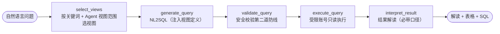

要点：
- **语义视图分两域**（`analytics/catalog.py`）：员工侧 5 张——`va_customer_overview`、`va_holding_distribution`、`va_transaction_stat`、`va_product_element`、`va_risk_alert_stat`（迁移 `0008`）；客户域 4 张——`va_my_holdings`、`va_my_transactions`、`va_my_funding_account`、`va_my_risk_assessment`（迁移 `0030`，ADR-0025）。候选集由各 Agent 的 `AgentConfig.view_names` 声明，两域互不可见。视图的列清单从 `information_schema` 内省，防止与迁移漂移。
- **行级权限内建在视图定义里**：员工侧（迁移 `0008`）理财顾问/风控专员全量，客户经理只见名下客户；客户域（迁移 `0030`）锁死为凭证客户本人。两域都是未设置身份返回零行（fail closed），各由 `NO SQL` 函数读自己的会话变量——员工侧 `@analytics_employee_id` / `@analytics_employee_role`，客户域 `@analytics_customer_id`。
- **三重保护**：① 受限 DB 账号 `wealth_analytics` 只对这组视图有 SELECT（`app/db/analytics_account.py`）；② 提示词只允许单条 SELECT 且只允许视图；③ 代码校验拒绝注释、多语句、会话变量、非 SELECT 首词、写类/DDL 关键词（`analytics/validation.py:64-81`）。
- 执行侧：结果行数上限 200（超出截断并标记）、`max_execution_time` 5s、连接归还前重置身份。
- 留痕：`AnalyticsQueryAudit`（成功与拒绝都记）。

### 1.3 投顾助手 Agent（`advisory`）

**面向对象**：理财顾问（审核动作只有理财顾问有权做）。**能力边界**：输入只能是经适当性硬过滤后的**候选池**。默认产出投顾内容，必须审核。

**运行时图**（`backend/app/advisory/graph.py:75`，用 LangGraph `interrupt()` 暂停等人工审核）：

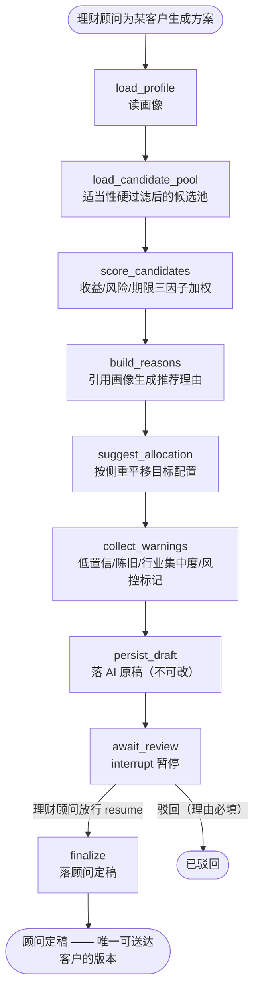

要点：
- **两版本留痕**：`AdvisoryDraft`（AI 原稿）只写不改，`AdvisoryFinal`（顾问定稿）同样不可改；客户侧只读最新定稿 `GET /api/customer/advisory/plan`。
- 审核放行前**重新校验候选池**，越池一律拒绝（`advisory/review.py:96`）。
- 状态机：待审 → 处理中 → 已放行 / 已驳回；认领用原子 `UPDATE ... WHERE status=待审` 加锁。
- 排序三因子：收益（池内归一化）、风险（等级差）、期限匹配；侧重（均衡/收益优先/流动性优先）改变权重，不改代码（`advisory/scoring.py:24`）。
- 风控告警以「风险标记」形式进入方案（`advisory/warnings.py:41`），来源是事件总线订阅到的风控预警。

### 1.4 业务操作 Agent（`operation_advice`）

**面向对象**：客户经理（发起动作），理财顾问（放行动作）。**能力边界**：输入同样只能是经适当性硬过滤后的**候选池**，加上客户自己的持仓与资金账户；产物是**单笔**操作建议——一个产品、一个方向、一个金额、一条理由（ADR-0017：与投顾助手的分工在产物）。默认产出投顾内容，必须审核。

**运行时图**（`backend/app/operation_advice/graph.py`，与投顾助手共用同一个 checkpointer 与 `interrupt()`）：

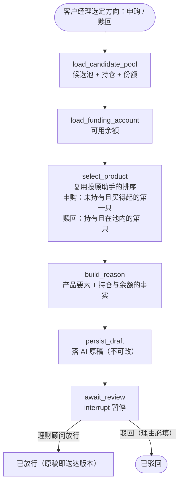

要点：
- **不引入第二套排序**：选品复用 `app.advisory.scoring.rank_candidates`，与投顾助手是同一份判断、同一套权重，两个 Agent 不会各排各的。
- **金额由要素与持仓算出来**：申购取产品起投金额、赎回取该持仓的成交金额，两个数都走 `app.order_acceptance` 的成交口径——生成一条当场会被拒绝的建议没有意义。
- **三条硬边界**：一次一个产品一个方向（载荷表上各是一列）、金额必填（`amount > 0`）、禁止收益预测与配置比例表述（落在理由的文字上，`operation_advice/reasons.py` 刻意不复用方案的理由生成）。
- **发起权**：只有客户经理能发起、且只对名下客户；放行仍只有理财顾问（`app/operation_advice/service.py` 与入口依赖各守一道门）。
- **同一条审核流水线**：原稿 + 「内容类型 + 内容引用」的审核记录（ADR-0020），队列、加锁与中断恢复与方案共用同一条。

### 1.5 风控监测 Agent（`risk_monitoring`）

**面向对象**：风控专员（处置动作）、全体内部员工（查看）。**特点**：主链路是**确定性规则引擎**，不是 LLM。

**两条输入**：

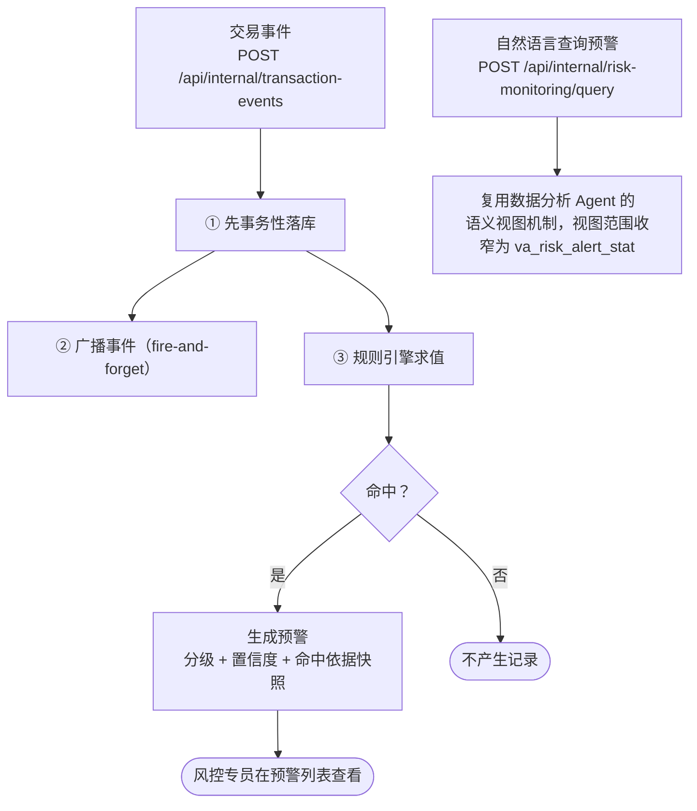

要点：
- **先落库再广播**：交易记录不依赖广播通道保证不丢（`risk_monitoring/alerting.py:315`）。
- **封闭算子集**（`operators.py:142`）：单笔比较 + 窗口聚合（count/sum/max/distinct_count/daily_*），阈值判断不经过 LLM。
- **封闭字段集**（`fields.py:161`）：11 个字段，复合语义（反向交易间隔、贴近大额申报阈值等）写在代码里。
- **初始 20 条反洗钱规则** `R001`~`R020`（`rules.py:84`），7 类：大额 / 频繁 / 快进快出 / 拆分规避 / 异常时段 / 资产错配 / 适当性。规则可由风控专员创建、修改与删除，种子只在建库时播种一次，因此规则集是一份起点而非固定清单（ADR-0026 / ADR-0027）。
- **分级**（`grading.py:35`）：单规则命中 → 轻度；多规则 → 中度；多规则且历史有预警 → 重度。置信度仅用于排序展示，**不用于自动关闭预警**。
- 预警状态只有三种：未处理 / 已排除 / 已升级，无自动关闭。
- 处置动作：派生工单、升级、判定误报（理由必填，只能处置一次）。

---

## 2. Agent 之间、功能之间怎么联系

### 2.1 事件总线：Agent 协作的唯一通道

`backend/app/event_bus.py` 的定位：**广播是通知，不是数据通道**。核心链路（交易落库、规则匹配、预警生成）不依赖广播通道；发布走 `publish_safely`，失败只记日志、绝不回滚（`event_bus.py:217-233`）。

- **信封**固定五件事：事件类型、来源、载荷、时间戳、追踪标识。
- **订阅注册表** `Subscriptions`：发布方按事件类型从注册表取订阅方，**新增订阅不需要改发布方**。
- **两件事互相独立**：`FanoutPublisher` 先出站（Redis Pub/Sub，仅出站镜像）再分发（进程内订阅方，放在 `finally` 里）。即 Redis 抖动不影响进程内协作（ADR-0013）。
- **订阅方只写自己那一条记录**，另一个线程/会话隔离（`_sibling_session`），一位听众失败不影响发布方与其他听众。

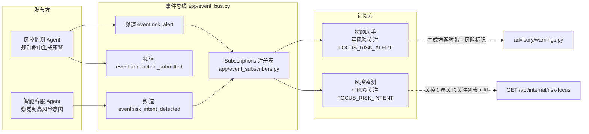

**两条落地的协作**（`app/event_subscribers.py:85-98`）：

| 事件类型 | 发布方 | 订阅方 | 落下的记录 | 下游效果 |
|---|---|---|---|---|
| `risk_alert` | 风控监测 | 投顾助手 | 风险关注（带等级与命中规则） | 投顾生成方案时带风险标记；只能处置时走工单 |
| `risk_intent_detected` | 智能客服 | 风控监测 | 风险关注（无等级，只是一次观察） | 风控专员在风险关注列表看到该客户 |

> **风险关注**（`app/risk_focus.py`）只追加、不改写，没有「已处理」状态 —— 它既不是预警（规则命中的事实记录），也不是工单（处置流程载体），而是「谁在什么时候因为什么提醒了谁」。

### 2.2 业务链路：从风评问卷到顾问定稿

这条链把「风险测评 → 画像 → 适当性 → 候选池 → 投顾方案 → 审核 → 送达客户」串起来，是系统的业务主干。

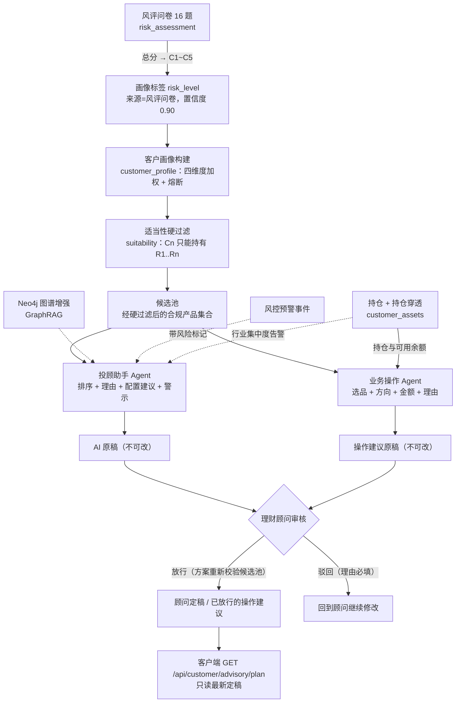

配套环节：
- **画像置信度**（`customer_profile/confidence.py:32-46`）：来源初始值（顾问手工 0.95 / 风评问卷 0.90 / AI 提取 0.70 / 客户自述 0.55 / 默认 0.30）+ 证据增益 − 冲突惩罚 − 时间衰减（0.2/年）。
- **断点熔断**（`judgement.py:113`）：<18 或 >80 岁、无收入低资产、评测过期。
- **持仓穿透**（`customer_assets/look_through.py:33`）：MySQL 递归 CTE 逐层展开到底层资产，带深度上限与成环检测，用于识别集中度风险。
- **客户可见视图边界**：客户侧数据访问只经客户本人边界，画像与服务记录在其之外。

### 2.3 知识链路：文档到带引用的回答

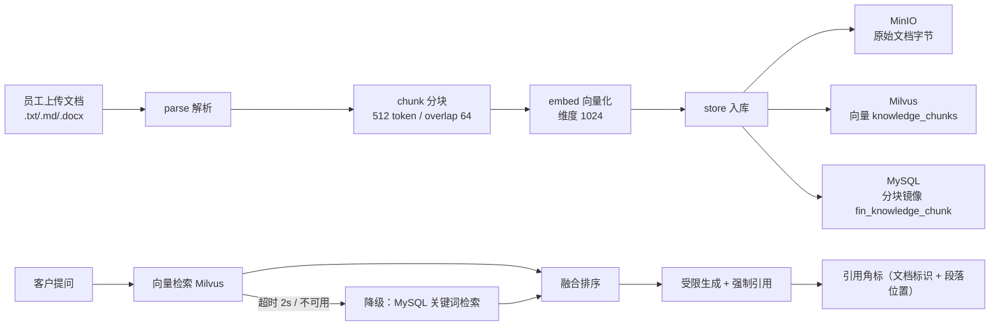

同一份内容三处落地各有分工：**MinIO 存原始文档**（删除时归档而非物理删）、**Milvus 存向量**、**MySQL 存分块镜像**（既是检索降级路径，也是图谱与统计的数据源）。

### 2.4 图谱链路：MySQL 投影 → GraphRAG

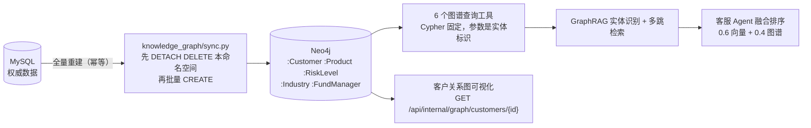

- 图谱是 **MySQL 的只读投影读模型**（ADR-0002）：单向、全量重建、脏了就重建，不做双向同步。
- GraphRAG 四类静默降级：超时 / 不可达 / 问题不含实体 / 图谱正在重建 —— 降级为纯向量检索，**不把错误抛给使用者**。
- 图谱工具查询超时 3s；可视化视图超时返回空图。

### 2.5 降级、留痕与可观测

- **降级**（`app/degradation.py`）：模型、向量库、图谱、缓存、事件总线五类依赖各有备用路径，每次降级写一条 **降级留痕**（`DegradationTrace`），用于回答「系统实际有多少时间在降级状态下工作」。
- **三级留痕**：
  - 审计级 `ConversationArchive`（永久，合规举证：使用者、Agent、问题、答案、引用、内容分类）；
  - 调试级 `AgentDebugTrace`（保留 30 天后清理，含完整提示词、检索片段、token 与耗时）；
  - 降级留痕 `DegradationTrace`。
- **trace_id** 贯穿一次请求及其触发的全部事件（`app/tracing.py`）。
- **周期任务**：进程内调度（不引入分布式任务队列），目前只有画像置信度校准（`app/scheduler.py`）。
- **回放模式**（ADR-0008，`demo_replay=True`）：各外部依赖缝改走 `app/replay/` 的预置数据（Redis 用进程内缓存替身、事件出站就地丢弃、不连 Milvus/Neo4j），但业务管线照走，跨 Agent 协作照常发生。

---

## 3. Docker 容器：在哪里用、怎么用

六个容器定义在根目录 `docker-compose.yml`，端口全部刻意错开默认值。一键启动脚本 `start-all.bat` 会先 `docker compose up -d --wait`（等待健康检查通过）再起前后端。

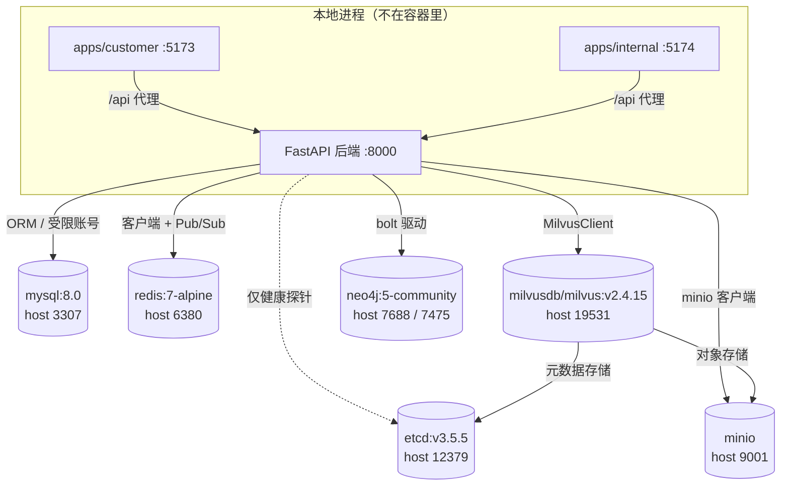

### 3.1 MySQL（`mysql:8.0`，3307 → 3306）

| 项 | 内容 |
|---|---|
| 配置 | `app/settings.py:15-28`（`database_url` / `test_database_url` / `mysql_root_url` / 受限账号）；`backend/.env.example` |
| 会话 | `app/db/session.py`：`get_session`（请求依赖）、`open_session`（周期任务） |
| 模型 | `app/db/models.py`（约 30 张表）；迁移 `backend/migrations/versions/0001~0022` |
| 容器特殊命令 | `--log-bin-trust-function-creators=ON` —— 因为语义视图的行级权限函数由迁移账号创建 |
| 初始化脚本 | `backend/docker/init-test-db.sql` 挂到 `/docker-entrypoint-initdb.d/`：建测试库 `wealth_test` 并给 `wealth_app` 授权 |

**怎么用**：
1. **唯一的权威写入源**。所有领域模块经 ORM 读写。
2. **语义视图 + 行级权限函数**在两处迁移：员工侧 `0008_semantic_views.py`（`analytics_employee_id()` / `analytics_employee_role()` 与 5 张只读视图），客户域 `0030_customer_domain_semantic_views.py`（`analytics_customer_id()` 与 4 张只读视图，ADR-0025）。函数都是 `NO SQL`，只读会话变量。
3. **受限执行账号** `wealth_analytics`：不在迁移里创建，而是 `app/db/analytics_account.py:64` 用 root 连接 `CREATE USER` 并**只 GRANT 这组视图的 SELECT**。执行 SQL 前 `SET @analytics_employee_id/@analytics_employee_role` 或 `@analytics_customer_id`，归还前重置（`analytics/execution.py:76`）。
4. **初始化顺序有依赖**（`app/db/setup.py:8-15`）：迁移 → 种子数据 → FAQ 入库 → 建受限账号授权。`pnpm dev` 启动后端前会重跑一次。

### 3.2 Redis（`redis:7-alpine`，6380 → 6379）

| 用途 | 代码位置 | 键/频道 | TTL |
|---|---|---|---|
| 登录会话白名单 | `auth/session_store.py` | `auth:session:{sid}` | 7 天（登出即删） |
| 会话短期记忆 | `agent/memory.py` | `agent:memory:{session_id}`（List，RPUSH + LTRIM） | 30 分钟滑动续期 |
| 画像缓存（Cache-Aside） | `customer_profile/service.py` | `customer_profile:{customer_id}` | 300 秒 |
| 风险测评草稿 | `risk_assessment/service.py` | `risk_assessment:draft:{customer_id}` | 无 |
| 事件总线出站频道 | `event_bus.py:38,147` | `event:{event_type}` | Pub/Sub，无 TTL |

**怎么用**：`app/redis_client.py` 用 `from_url` 并显式设置连接/读写超时（各 2s），避免一次连接挂起把请求线程吊住 —— 这正是「缓存不可用就直连数据库」能触发的前提。任何 `RedisError` 都视为未命中并记降级留痕，不抛给使用者。回放模式返回进程内 `InMemoryCache`。

> 注意：**Redis 只是事件总线的出站镜像**，本进程内的订阅分发不经过它（ADR-0013）。

### 3.3 etcd（`quay.io/coreos/etcd:v3.5.5`，12379 → 2379）

- **业务代码不直接使用**。全仓对 etcd 的引用只有两处：`settings.py:41` 的 `etcd_url`，以及 `app/health.py:78-81` 的健康探针（HTTP GET `/health`）。
- **真实用途是 Milvus 的元数据存储**：compose 里 `ETCD_ENDPOINTS: etcd:2379`，Milvus `depends_on` 它并要求 `service_healthy`。

### 3.4 MinIO（`minio`，9001 → 9000）

| 项 | 内容 |
|---|---|
| 客户端 | `app/knowledge/object_store.py`（`ensure_bucket` / `upload` / `archive` / `delete_if_exists`） |
| Bucket | `wealth-knowledge`（`settings.py:57`） |
| 对象键 | `knowledge/{knowledge_id}/{filename}` |

**怎么用**：知识文档入库时上传**原始文档字节**（`knowledge/service.py:155`），删除文档时**打 archived 标签归档**而非物理删除（`:257`）。存内容失败会回滚已上传的对象与已插入的向量。

> 分块镜像与会话归档写的是 **MySQL**，不进 MinIO —— MinIO 只负责原始文档。

### 3.5 Milvus（`milvusdb/milvus:v2.4.15`，19531 → 19530）

| 项 | 内容 |
|---|---|
| 客户端 | `app/knowledge/vector_store.py`（pymilvus `MilvusClient`） |
| 集合 | `knowledge_chunks`（测试 `knowledge_chunks_test`） |
| 向量 | 维度 1024，度量 `COSINE`，一致性 `Strong`；维度写错会直接报错（建集合后不可改） |

**怎么用**：
- **写**：`embed_texts`（`knowledge/embeddings.py`，真实 provider 走 OpenAI 兼容接口、按 10 条分批）→ `insert_chunks`（`service.py:160-177`），同时覆盖写 MySQL 分块镜像。
- **读**：`vector_store.search` 发起检索，主线程用 `ThreadPoolExecutor` 施加 **2s 墙钟软超时**（`settings.py:121`）。超时 → `DEGRADED_VECTOR_TIMEOUT`，其他异常 → `DEGRADED_VECTOR_UNAVAILABLE`，两者都降级为 **MySQL 分块镜像的关键词检索**并记降级留痕（`service.py:428-537`）。
- 回放模式完全不碰 Milvus。

### 3.6 Neo4j（`neo4j:5-community`，7688 → 7687、7475 → 7474）

| 项 | 内容 |
|---|---|
| 客户端 | `app/neo4j_client.py`（强制 `connection_timeout`） |
| 命名空间 | `wealth`（测试 `wealth_test`，同一实例内靠属性隔离） |
| 节点 | `:Customer` `:Product` `:RiskLevel` `:Industry` `:FundManager` |
| 关系 | `:HOLDS` `:HAS_RISK_LEVEL` `:BELONGS_TO_INDUSTRY` `:MANAGED_BY` `:SUITABLE_FOR` |

**怎么用**：
1. **投影重建**：`knowledge_graph/sync.py:284` 的全量重建 —— 先 `DETACH DELETE` 本命名空间，再按 MySQL 当前状态批量 CREATE，单写事务保证旧图在重建期间仍可用；用 `biz_graph_sync_run` 唯一约束做并发互斥。触发入口 `POST /api/internal/graph/rebuild`（回放模式明确拒绝）。
2. **GraphRAG 增强**：`knowledge_graph/graphrag.py:245` 实体识别 → 多跳 Cypher 查询 → 图谱段落，3s 软超时，四类静默降级。
3. **图谱工具**：`knowledge_graph/tools.py` 六个工具（客户持仓、产品行业、按风险等级查产品、客户行业敞口、共同持仓、基金经理产品），**Cypher 固定、参数是实体标识**，Agent 不拼语句（防注入）。
4. **可视化**：`GET /api/internal/graph/customers/{id}?expand=fund_manager`，超时返回空图。

---

## 4. 功能与代码位置索引

| 功能 | 后端模块 | 主要 API 前缀 | 前端 |
|---|---|---|---|
| 身份与登录（双身份域） | `app/auth/` | `/api/customer/auth/*`、`/api/internal/auth/*` | 两个应用的 `auth/` |
| 智能客服对话 + SSE | `app/agent/`、`app/knowledge/` | `/api/customer/chat/*` | `apps/customer/chat/` |
| 知识库管理（上传/检索试验） | `app/knowledge/` | `/api/internal/knowledge/*` | `apps/internal/knowledge/` |
| 风险测评 | `app/risk_assessment/` | `/api/customer/risk-assessment/*` | `apps/customer/risk-assessment/` |
| 客户画像与置信度 | `app/customer_profile/` | `/api/internal/customers/{id}/profile` | `apps/internal/profile/` |
| 适当性与候选池 | `app/suitability/` | `/api/customer/candidate-pool` | — |
| 产品筛选 | `app/product_screening/` | `/api/customer/products` | `apps/customer/products/` |
| 资产与持仓穿透 | `app/customer_assets/` | `/api/customer/assets/*` | `apps/customer/assets/` |
| 投顾助手与审核流 | `app/advisory/` | `/api/internal/advisory/*` | `apps/internal/advisory/` |
| 操作建议（业务操作 Agent） | `app/operation_advice/` | `/api/internal/customers/{id}/operation-advice` | `apps/internal/customer-relations/`（发起，见 #09） |
| 客户方案请求 | `app/advisory_request/` | `/api/customer/advisory-requests` | `apps/customer/products/`（提交）、`apps/customer/advisory/`（进度） |
| 客户侧方案送达 | `app/advisory/final.py` | `/api/customer/advisory/plans` | `apps/customer/advisory/` |
| 数据分析（NL2SQL） | `app/analytics/` | `/api/internal/analytics/*` | `apps/internal/analytics/` |
| 知识图谱与 GraphRAG | `app/knowledge_graph/` | `/api/internal/graph/*` | `apps/internal/graph/` |
| 风控监测与预警 | `app/risk_monitoring/` | `/api/internal/risk-alerts/*` | `apps/internal/risk/` |
| 工单处置 | `app/work_order/` | `/api/internal/work-orders/*` | `apps/internal/risk/` |
| 风险关注 | `app/risk_focus.py` | `/api/internal/risk-focus` | `apps/internal/risk/` |
| 会话归档 / 留痕 / 降级统计 | `app/agent/archive.py`、`debug_trace.py`、`degradation.py` | `/api/internal/conversations`、`/api/internal/traces/*` | — |
| 回放模式 | `app/replay/` | — | — |

---

## 5. 设计要点速记

1. **五个 Agent 是五份配置，不是五套实现**（ADR-0007）。路由按登录身份在入口确定，不存在运行时的意图分发。
2. **确定性判断不经过模型**：适当性硬过滤、风控阈值、投顾排序、高风险意图识别都是代码。
3. **未审核内容不可送达**：投顾内容默认分类即投顾内容，AI 原稿永久留存用于举证审核是否为实质性审核。
4. **Agent 协作走事件总线，广播是增强不是数据通道**：广播失败只记日志，核心链路继续。
5. **降级后仍是成功响应**，只是依据可能更弱；降级不产生错误，所以另记降级留痕才看得出系统有多少时间在降级状态工作。
6. **`packages/shared` 的边界是构建闸门**：`check-boundary.mjs` 在 build 时词法扫描，命中业务语义（风控字段、预警分级、审核状态、画像权重等）即中断构建（ADR-0003）。
